# 🚗 Aplikasi Rental Mobil (Corporate Clean)

Aplikasi web manajemen rental mobil modern yang dibangun menggunakan **Laravel**, **Tailwind CSS**, dan **Blade Components**. Mengusung standar desain *Corporate Clean* yang konsisten, responsif, dan intuitif, serta dilengkapi dengan integrasi pembayaran digital **Midtrans**, fitur **REST API**, dan sistem keamanan hak akses berbasis *role* (Admin dan User).

## 👨‍🎓 Identitas Mahasiswa
* **Nama:** Angga Firnanda
* **NIM:** 230170149
* **Mata Kuliah:** Pemrograman Web Lanjut (A8)

---

## 🔑 Akun Demo
Untuk menguji fitur pemisahan hak akses (Role-Based Access Control), silakan gunakan kredensial berikut:

**Akun Administrator:**
* Email: adminrental@test.com
* Password: adminrental123

**Akun Pelanggan (User):**
* Email: customerrental@test.com
* Password: customerrental123

---

## 🔗 Fitur

* Autentikasi pengguna dengan verifikasi email (Laravel Breeze)
* Role pengguna: Admin dan User (Pelanggan) dengan hak akses berbeda
* CRUD lengkap untuk data Mobil dan Transaksi (Admin)
* Pemesanan mobil dengan integrasi pembayaran digital via Midtrans
* Alur konfirmasi reservasi: Pending → Confirmed/Cancelled → Completed
* Dashboard admin dengan statistik ringkas dan grafik penyewaan
* Desain responsif (desktop & mobile)
* REST API dan export laporan PDF

---

## 🛠️ Tech Stack & Tools

*   **Backend:** Laravel 11 (PHP Framework)
*   **Frontend:** Tailwind CSS, Blade Components, Alpine.js
*   **Database:** MySQL / SQLite
*   **Payment Gateway:** Midtrans Snap API
*   **Tools:** Postman (API Testing), Git

---

## 👥 Pemisahan Hak Akses (Admin & User)

Aplikasi ini menerapkan pemisahan hak akses yang ketat menggunakan *middleware* kustom:
*   **Role Admin:** Memiliki akses penuh melalui panel **Sidebar** untuk manajemen inventaris mobil (CRUD), verifikasi data, memantau seluruh transaksi, dan mengunduh laporan PDF.
*   **Role User/Customer:** Memiliki akses melalui panel **Topbar** untuk melihat katalog, melakukan pemesanan mobil, melakukan pembayaran via Midtrans, dan melihat riwayat transaksi pribadi.

---

## 📸 Dokumentasi & Bukti Fitur (Screenshots)

Berikut adalah dokumentasi tangkapan layar yang membuktikan bahwa seluruh fitur utama aplikasi telah berjalan dengan baik. 

*(Catatan: Gambar disimpan di dalam folder proyek/repositori. Pastikan path gambar sesuai).*

### 1. Halaman Login
> Menampilkan antarmuka autentikasi pengguna dengan desain minimalis dan modern.

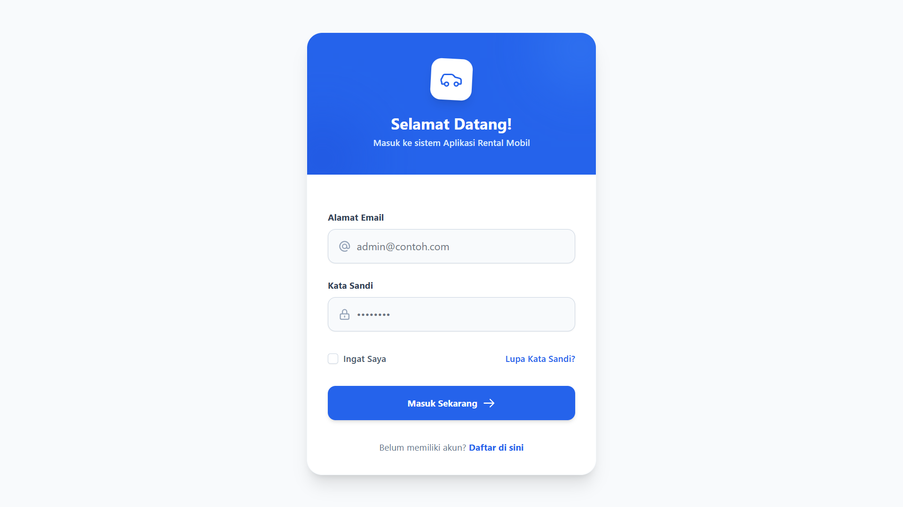

### 2. Halaman Registrasi
> Menampilkan antarmuka autentikasi pengguna dengan desain minimalis dan modern.

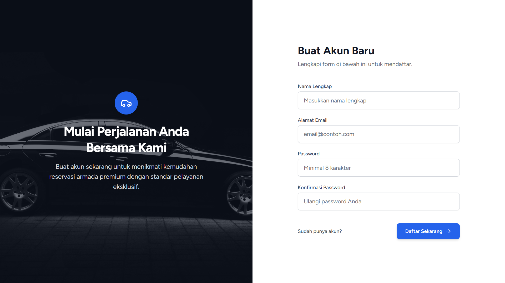

### 3. Verifikasi Email
> Fitur konfirmasi keamanan akun melalui pengiriman tautan verifikasi ke email pengguna (`MustVerifyEmail`).

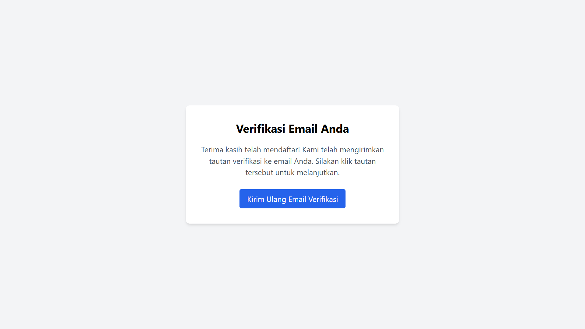

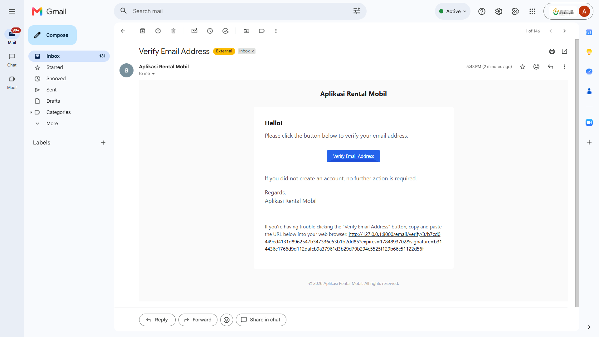

### 4. Dashboard
*   **Dashboard Admin:**
    > Menampilkan ringkasan statistik operasional, total armada, dan pemantauan cepat aktivitas rental.
    
    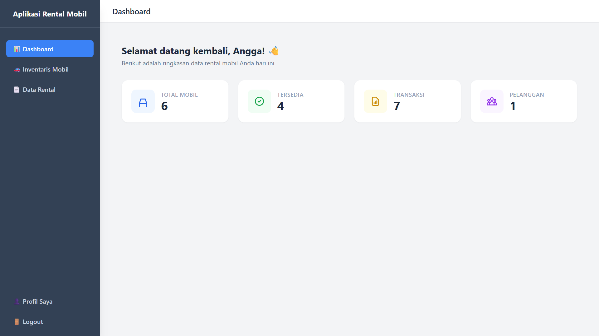

*   **Dashboard User:**
    > Menampilkan informasi ringkas akun dan status pemesanan aktif pengguna.
    
    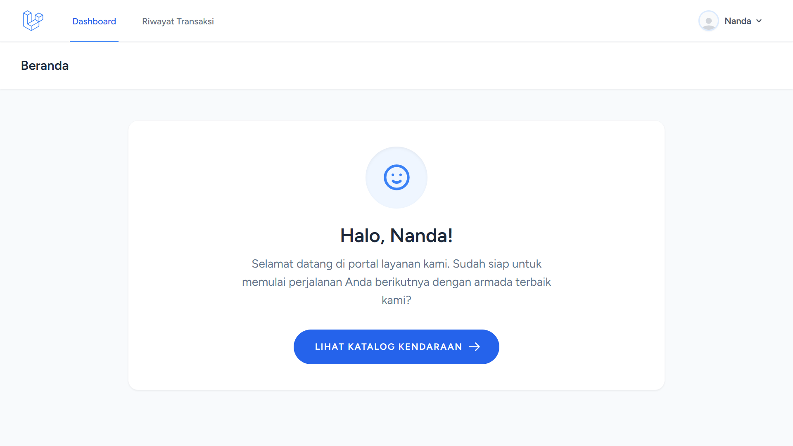

### 5. CRUD Inventaris Mobil (Admin)
> Fitur pengelolaan data kendaraan lengkap mencakup Tambah (Create), Lihat (Read), Ubah (Update) dengan *preview* foto sejajar, dan Hapus (Delete).

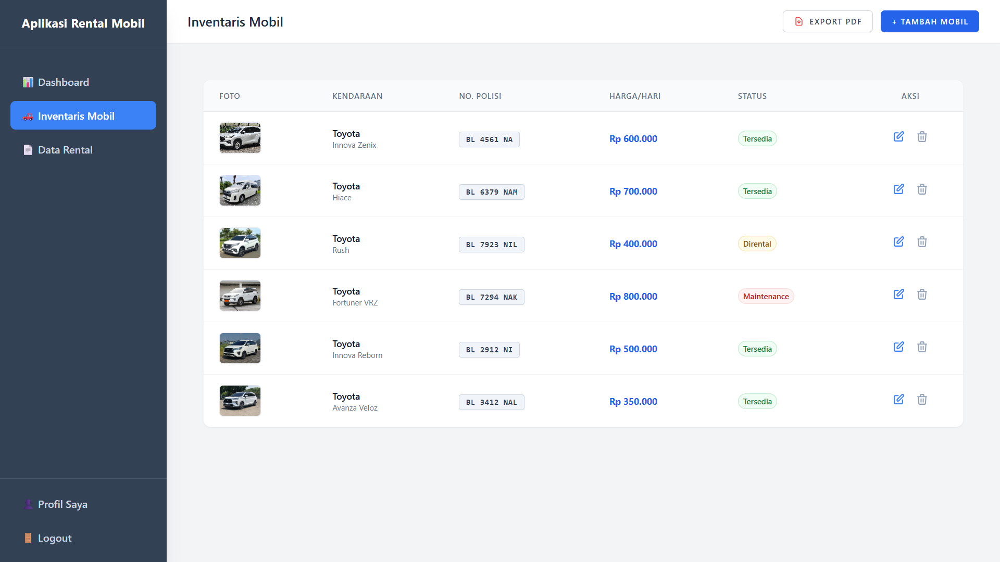

### 6. REST API & Hasil Pengujian Postman
> Endpoint API yang mengembalikan data format JSON untuk integrasi layanan luar, lengkap dengan dokumentasi hasil pengujian *Response Code 200 OK* pada Postman.

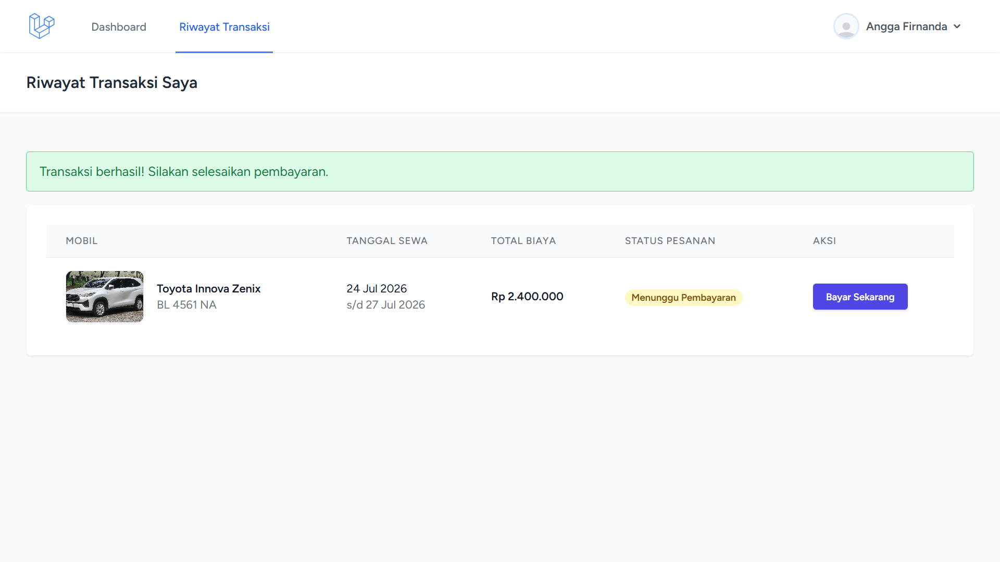

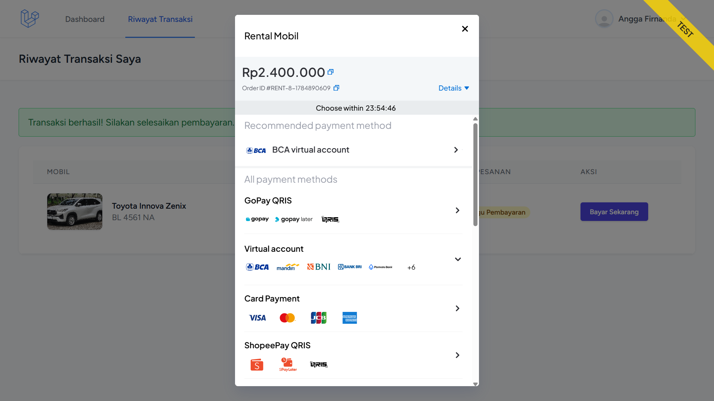

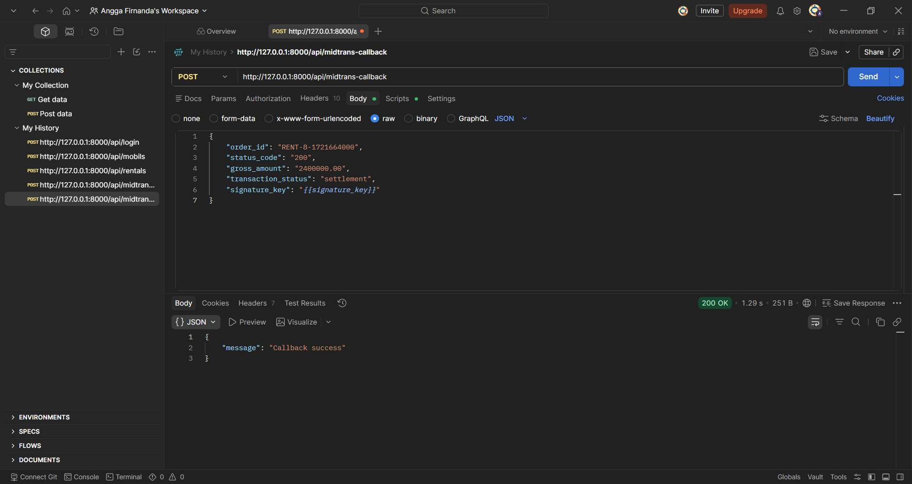

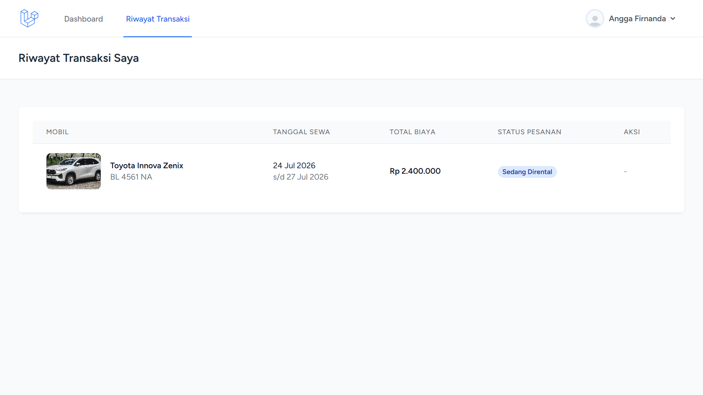

### 7. Pemisahan Hak Akses (Admin & User)
> Perbandingan tata letak navigasi: **Sidebar** eksklusif untuk Admin dan **Topbar** bersih untuk User.
*   **Tampilan Navigasi Admin (Sidebar):**
    
    

*   **Tampilan Navigasi User (Topbar):**
    
    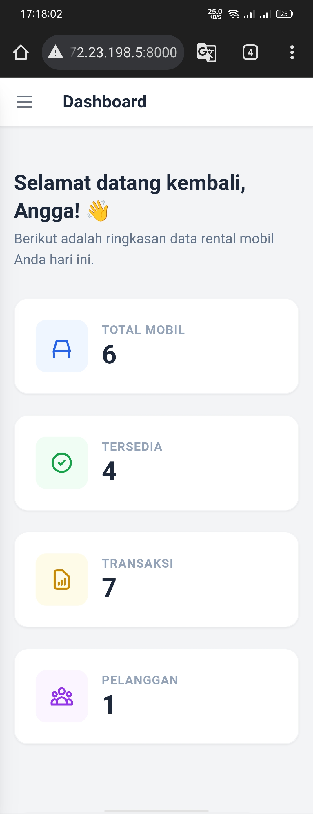

### 8. Tampilan Responsif (Desktop & Mobile)
> Pengujian layout yang adaptif dan fleksibel pada berbagai ukuran layar perangkat.
*   **Tampilan Desktop:**
    
    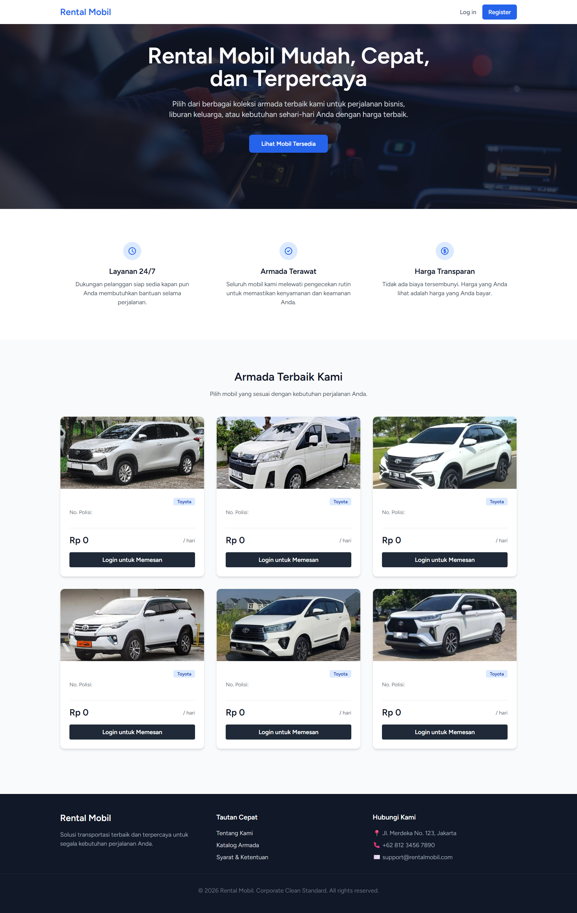

*   **Tampilan Mobile:**
    
    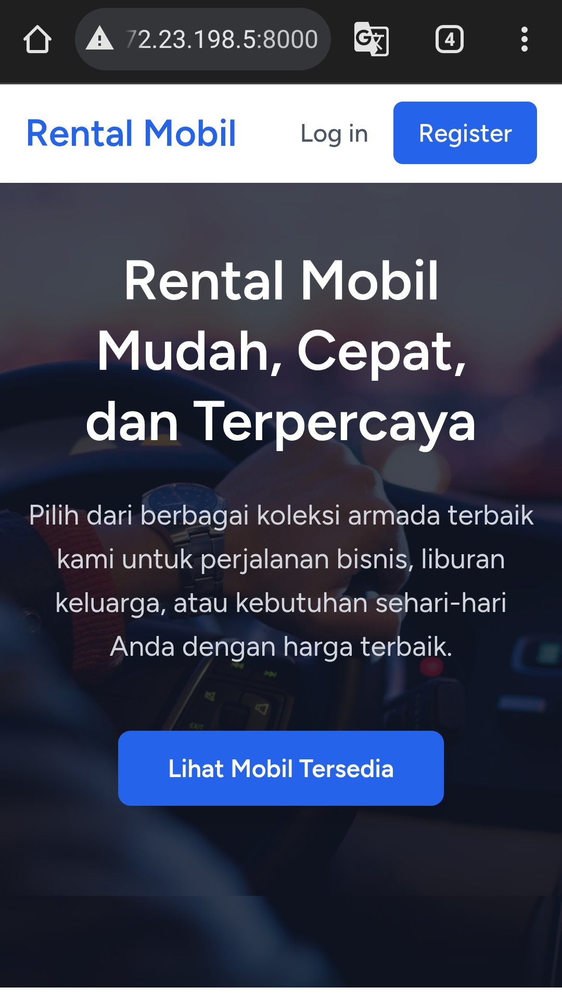

### 9. Hasil Export PDF
> Laporan transaksi dan rekapitulasi data rental yang berhasil diekspor ke dalam dokumen berformat PDF yang rapi.

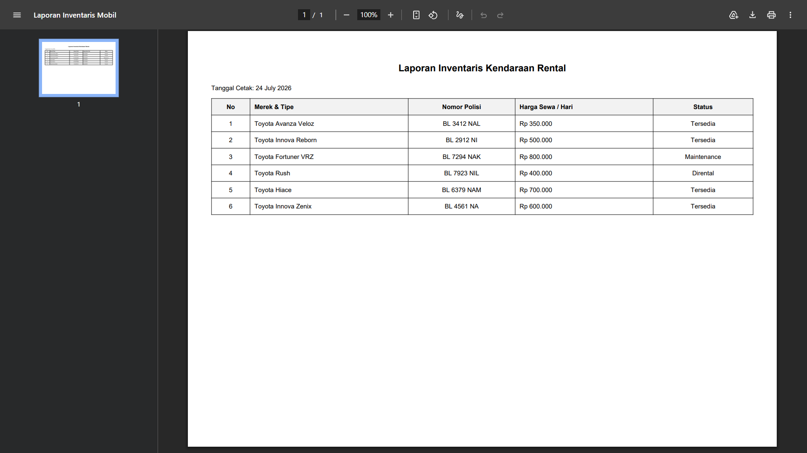

---

## 🚀 Panduan Instalasi & Menjalankan Proyek 

1. Clone repository:
   ```
   git clone <https://github.com/gatelogicnand/AplikasiRentalMobil.git>
   cd <AplikasiRentalMobil>
   ```

2. Install dependency PHP:
   ```
   composer install
   ```

3. Salin file environment dan generate application key:
   ```
   cp .env.example .env
   php artisan key:generate
   ```

4. Atur koneksi database di file `.env` (sesuaikan dengan MySQL/SQLite lokal):
   ```
   DB_CONNECTION=mysql
   DB_HOST=127.0.0.1
   DB_PORT=3306
   DB_DATABASE=db_rentalmobil
   DB_USERNAME=root
   DB_PASSWORD=
   ```

5. Jalankan migration:
   ```
   php artisan migrate
   ```

6. Install dependency frontend dan build asset:
   ```
   npm install
   npm run build
   ```

7. Jalankan server:
   ```
   php artisan serve
   ```

8. Buka aplikasi di browser: `http://localhost:8000`

### Membuat Akun Admin

Setelah registrasi akun baru lewat halaman `/register`, jadikan akun tersebut admin lewat Tinker:
```
php artisan tinker
```
```php
$user = \App\Models\User::where('email', 'email-akun-anda@contoh.com')->first();
$user->role = 'admin';
$user->save();
```